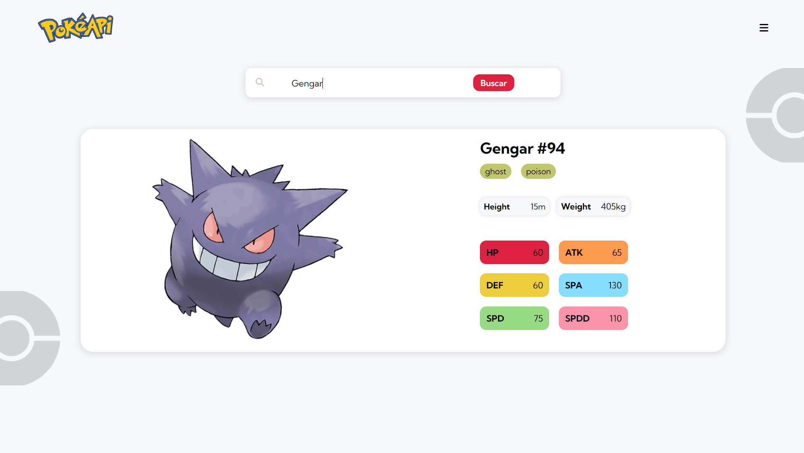

## PokeFinder

Uma aplicação simples que permite buscar informações sobre Pokémon, exibindo detalhes como nome, tipo e estatísticas em uma interface amigável. Este projeto foi desenvolvido para aplicar meus conhecimentos em HTML, CSS, JavaScript e no consumo de APIs REST. O layout da seção de estatísticas foi inspirado em um design compartilhado pela comunidade no Figma, que pode ser encontrado <a href="https://www.figma.com/design/7ZMz57e43zkZKDAEiY7cDE/PokéDex----A-PokeDex-Website-Design-(Community)?node-id=30-1062&t=L0m8rUvi9zZWQAnS-0">neste link.</a>


### Tecnologias Usadas

[](https://skillicons.dev)


### Como Rodar o Projeto

1. Clone o repositório:
   ```sh
   git clone https://github.com/lucasherrerods/poke-api
   ```
2. Abra o arquivo index.html no navegador para visualizar o projeto.


### Exemplo do Projeto

<div align="center">
    